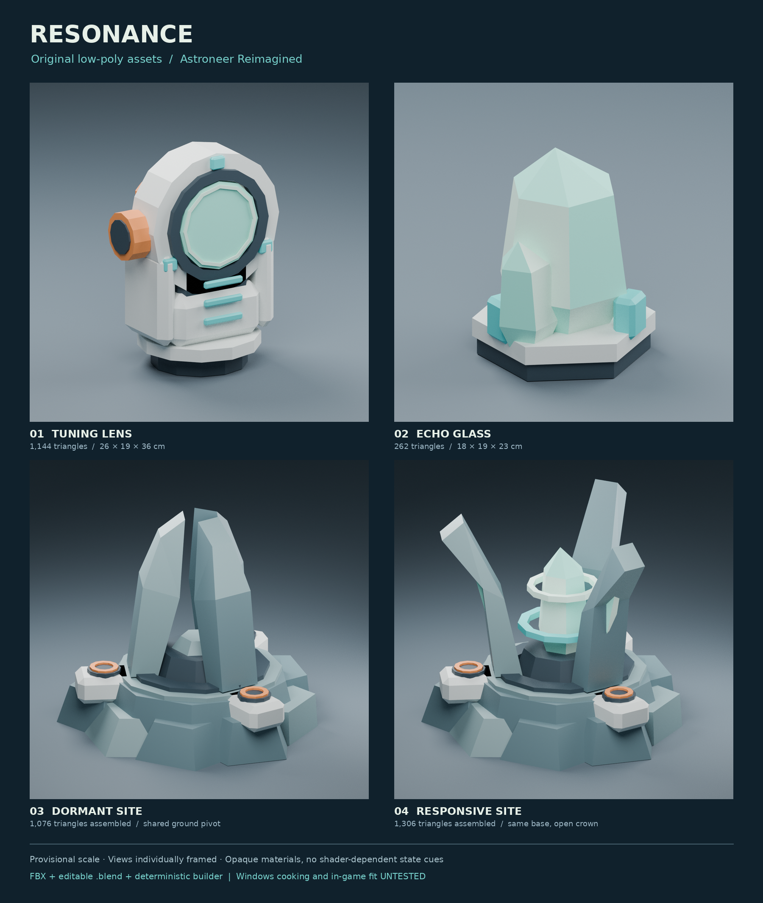

# Astroneer-Reimagined

**Resonance: original asset sources and UE 4.27 editor-authoring code. Not an installable or game-tested mod.**

This checkpoint adds five original low-poly meshes, editable Blender source, eight
material definitions, and a Python editor program intended to create native item
Blueprints and six mission definitions in the community ModdingKit. The authoring
program has **not been executed in Unreal**. No generated `.uasset`, cooked
`.pak`, loader registration, or functioning gameplay is supplied.



## Included
- [`assets/resonance/`](assets/resonance/): five FBXs, editable `.blend`, procedural builder, measured manifest and studio renders
- [`authoring/build_resonance.py`](authoring/build_resonance.py): editor-only import, original material graphs, item Blueprint/recipe links, site visual shell, and mission data authoring
- [`authoring/verify_resonance.py`](authoring/verify_resonance.py): in-editor serialized-reference checks to run after authoring and reopening
- [`content/resonance.json`](content/resonance.json) and [`prototype/progression.py`](prototype/progression.py): retained phase-one design and independent progression reference
- [`tools/stage_mod.py`](tools/stage_mod.py): allowlisted developer staging after a real Windows cook; does not cook, pack or install
- [`docs/unreal-authoring.md`](docs/unreal-authoring.md): exact editor procedure and bounded remaining Blueprint work
- [`docs/status.md`](docs/status.md), [`docs/source-validation.md`](docs/source-validation.md): evidence and verification limits

## Check the source
Python 3.10+, standard library only:

```sh
python3 -m unittest discover -s tests -v
python3 -m compileall -q authoring prototype tools tests
```

The 32 offline tests cover reference progression, source/input contracts and safe
staging with synthetic fixtures. They do not execute Unreal or Astroneer. Five
FBXs were independently round-tripped through Blender and inspected for geometry,
UVs, materials, scale and topology. Studio renders are not game screenshots.

## Next runnable milestone
Use the pinned community ModdingKit and UE 4.27.2 on Windows, following
[the authoring guide](docs/unreal-authoring.md). Verify actual game compatibility
first. Native reflected Python aliases, Blueprint defaults and serialization
still need editor confirmation. Gameplay event graphs, gas behavior, site
placement/persistence, mission event producers/core reconciliation and item catalog
registration remain to be implemented. Then cook, package and test on disposable
save copies, including the user's Linux/Proton setup.

Base-game-first, no DLC assumed. Names, economy and the broader expansion remain
provisional. Original sources contain no extracted game assets or redistributed
reference screenshots. Keep licensed engine/game dependencies outside this repo.
